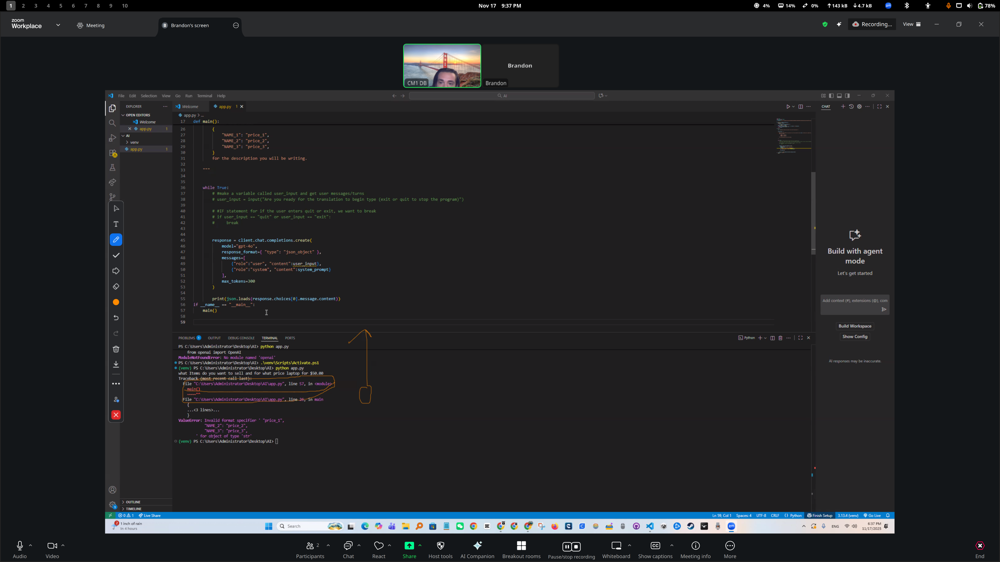
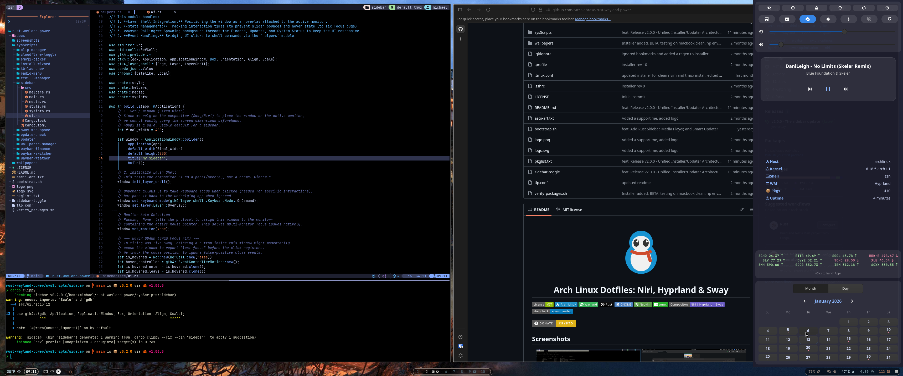

# Arch Linux Dotfiles: Niri, Hyprland & Sway (Rust-Powered)

<p align="left">
  <a href="./LICENSE"></a>
  <a href="https://archlinux.org/"></a>
  <a href="https://wayland.freedesktop.org/"></a>
  <a href="https://www.rust-lang.org/"></a>
  <a href="https://www.gnome.org/"></a>
  <a href="https://neovim.io/"></a>
  <a href="https://github.com/tmux/tmux"></a>
  <a href="#my-arch-dotfiles"></a>
  <a href="https://www.shellcheck.net/"></a>
</p>

This is my obsessive setup for a minimal, multi-compositor Arch Linux environment. I run niri mostly but sometimes hyprland (docked on external monitor), and a custom sway session (iGPU-only, hyper optimized for battery). I also have gnome. Gnome is there when a full desktop is needed. Some things, such as annotating on students screens in zoom, just will not work on anything but a full desktop. My other configs do assume you have gnome and all its dependencies.

**Credit to JaKooLit for the original inspiration. I have since heavily modified and optimized it for my needs. Many theme options and examples are available on <https://github.com/JaKooLit/Hyprland-Dots>**

The whole point is efficiency and performance. This setup idles at 4.8W on my ThinkPad X1 Extreme (i7-10850H, 64GB RAM, GTX 1650 Ti, 4k display).

This is a personal repo, not a beginner's guide. It assumes you know what you're doing.

## My Custom Rust Binaries

All the helper scripts in this repo have been rewritten in Rust for maximum performance and stability. **These tools can be used independently of the rest of my dotfiles.** Here is what each one does:

- **`waybar-switcher`**: A small utility that runs at login to detect which session you're in (Niri, Hyprland, or Sway) and automatically loads the correct Waybar config.
- **`waybar-weather`**: The weather module in Waybar. It's a custom-built app that securely gets your API key from the central config, finds your location, and fetches the weather.
- **`sway-workspace`**: A simple helper that reliably gets the current workspace name for the Waybar module in Sway.
- **`update-check`**: The update icon in Waybar. It safely checks for new `pacman` and `yay` updates and shows the count. It's network-aware and displays a "stale" count if you're offline.
- **`cloudflare-toggle`**:
  - **`cf-status`**: The "CF" icon in Waybar that shows if you are using Cloudflare DNS over HTTPS.
  - **`cf-toggle`**: The `on-click` script that securely toggles Cloudflare DNS over HTTPS on or off using `pkexec`.
- **`wallpaper-manager`**: A 3-part system that manages all your wallpapers.
  - **`wp-daemon`**: A silent, background daemon that watches your wallpaper folder for changes and auto-generates thumbnails.
  - **`wp-select`**: The Rofi-based pop-up menu (`Mod+W`) that lets you see your wallpaper thumbnails and choose a new one.
  - **`wp-apply`**: The back-end tool that actually sets the wallpaper, using the correct tool for your session (`swaybg` or `swww`).
- **`kb-launcher`**: The keybind cheat sheet (`Mod+Shift+P`). It's a pop-up menu that reads your `.txt` files to show you the keybinds for Niri, Sway, Hyprland, or Neovim.
- **`updater`**: The `on-click` script for the `update-check` module. It simply launches your terminal (`ghostty`) to run the actual system update.
    > ⚠️**WARNING!!!! My updated runs fwupdmgr as sudo with a -y flag.**
    > **Do not update with my updater** unless you are prepared to reboot or get sent into a bios update.
    > If you are not comfortable with this, find the "let bash_script = format!(..)" block of updater/src/main.rs (line 113) and change it to:
>
```rust
let bash_script = format!("{} \n exit_code=$? \n echo -e '\\n\\n🏁 Update process finished. This window will close in 5 seconds.' \n sleep 5 \n exit $exit_code", update_cmd_str);
```
>
- > Then rebuild:

```rust
cargo install --path .
```

- **`power-menu`**: The graphical power menu (`Ctrl+Alt+P`). It's a compositor-aware launcher for `wlogout` that automatically calculates the correct screen position and scaling for Niri, Hyprland, and Sway.
- **`rfkill-manager`**:
  - `--status`: The airplane icon in your SwayNC, showing if "Airplane Mode" is on or off.
  - `--toggle`: The `on-click` action (in your `swaync` panel or on a keybind) that toggles all wireless (Wi-Fi & Bluetooth) on or off.
- **`clip-manager`**: The clipboard history manager (`Mod+Alt+V`). It uses `cliphist` as a backend and pipes your selection to Rofi, allowing you to copy, delete, or wipe your clipboard history.
- **`emoji-picker`**: The emoji selector (`Mod+Alt+E`). It uses a built-in Rust emoji database to give you a fast, searchable Rofi menu for copying any emoji.
- **`radio-menu`**: A rofi based, extremely lightweight and low power consumption internet radio streaming tool that caches favorite stations for quick selection.
- **`waybar-finance`**: A lightweight TUI market watch list application with charts, and security details. Designed to be run in a terminal multiplexer like tmux or ghostty. This will request that you create and enter a Finnhub.io API key on first run. The app will display quoting of your watchlist items as a tooltip on hover over its icon in Waybar.

## Screenshots

<p align="center">
  
  
  
  </p>
<p align="center">
  
</p>

## Table of Contents

<details>
<summary><strong>Table of Contents</strong></summary>

- [Screenshots](#screenshots)
- [The Philosophy: Why Rust?](#the-philosophy-why-rust)
- [My Custom Rust Binaries](#my-custom-rust-binaries)
- [Installation Guide](#installation-guide)
  - [1. Core Dependencies (pacman)](#1-core-dependencies-pacman)
  - [2. Manual System Config (The "Gotchas")](#2-manual-system-config-the-gotchas)
  - [3. The Central Config (Your API Keys)](#3-the-central-config-your-api-keys)
  - [4. Building the Rust Apps](#4-building-the-rust-apps)
  - [5. Setting Up Your Configs & Secrets](#5-setting-up-your-configs--secrets)
  - [6. Final Startup](#6-final-startup)
- [Power Management Issues on my Hardware](#power-management-issues-on-my-hardware)
  - [dGPU Power Management (NVIDIA Hybrid Laptops)](#dgpu-power-management-nvidia-hybrid-laptops)
    - [1. Switch to greetd](#1-switch-to-greetd)
    - [2. BIOS Setup](#2-bios-setup)
    - [3. Set Kernel Module Parameters (The "Golden Config")](#3-set-kernel-module-parameters-the-golden-config)
    - [4. Set udev Rule](#4-set-udev-rule)
    - [5. Rebuild Everything](#5-rebuild-everything)

</details>

## The Philosophy: Why Rust?

*You'll see all my helper scripts are written in Rust. I'm not a "Rust-acean," but I am a pragmatist.*

*Why not Python? Because Python is the absolute worst. It's a slow, dependency-hell nightmare. I don't trust its supply chain, and honestly, I just don't vibe with it. I'll take C-style syntax any day.*

*Why not shell scripts? My old scripts were a disaster zone of pgrep, jq, sed, awk, and cat all piped together. They were fragile, slow, and worked like crap. Check out the [`sysScripts/`](sysScripts/) directory to see the Rust scripts that replaced them*

*But why not Zig? I love Zig. It's the future. But the sad reality is that its API changes so fast, I can't even learn the language before a pacman -Syu breaks everything I've written.*

*So, Rust. It gives me the C-like syntax and performance I want, with a stable ecosystem (cargo) that actually works. It's the best tool for the job right now. If the senior kernel devs hate rust, I stand with them, I make no comment or express no opinion on what should or should not be in the kernel.*

*Why ghostty? It is the best.*

# Installation Guide

## 1. Core Dependencies (pacman)

This won't be a one-click install. You need to build the base.
Bash

### The compositors and base DE (for services)

```bash
sudo pacman -S sway hyprland niri gnome
```

### Core UI tools

```bash
sudo pacman -S waybar hyprlock swayidle wofi rofi wlogout hypridle tlp
```

### Key system services & utilities

```bash
sudo pacman -S polkit-gnome nm-applet udiskie geoclue greetd greetd-tuigreet
sudo pacman -S pulseaudio # or pipewire-pulse, your call
```

### Our custom scripts will need these

```bash
sudo pacman -S cloudflared pacman-contrib fakeroot rfkill cliphist wl-clipboard
```

### User apps I use

```bash
sudo pacman -S ghostty thunar
```

### Build toolchain for our Rust apps

```bash
sudo pacman -S rustup openssl pkg-config libc
```

## 2. Manual System Config (The "Gotchas")

You must do these steps as sudo. My scripts depend on this.

### geoclue (for Weather)

The default Mozilla backend is dead. We use Google.

Get a Google Geolocation API key.

Edit /etc/geoclue/geoclue.conf.

Find the [wifi-scan] section and add your key:
Ini, TOML:

```ini
[wifi-scan]
url=https://www.googleapis.com/geolocation/v1/geolocate?key=YOUR_GOOGLE_KEY_HERE
```

Restart the service: sudo systemctl restart geoclue.service.

### systemd-resolved (for DNS)

My cloudflare-toggle script manually writes to /etc/resolv.conf. This only works if systemd-resolved isn't fighting you.

```bash
sudo systemctl disable --now systemd-resolved
sudo rm /etc/resolv.conf
sudo touch /etc/resolv.conf
echo "nameserver 1.1.1.1" | sudo tee /etc/resolv.conf
```

### zsh and $PATH

My scripts (and niri/sway/hyprland) will fail if they can't find the Rust binaries. You must add cargo to your path in a way that non-interactive sessions can read.

Create this file: ~/.config/environment.d/99-custom-path.conf

Put this one line in it:

```bash
PATH=$HOME/.cargo/bin:$HOME/.pub-cache/bin:$PATH
```

Log out and log back in. ~/.zshrc is the wrong place for this.

### Clean Session Switching

If you find that tray icons ('nm-applet', 'waybar') are duplicating when you switch sessions, it's because your old session's apps aren't being killed.

1. Edit your 'logind.conf':

```bash
sudo nano /etc/systemd/logind.conf
```

2. Find the line '#KillUserProcesses=no' and change it to 'yes':
ini:

```ini
killUserProcesses=yes
```

3. Restart the service to apply:

```bash
sudo systemctl restart systemd-logind.service
```

## 3. The Central Config (Your API Keys)

All of our custom Rust scripts are controlled by one file. This is where you put your API keys and personal paths.

Copy the template:
Bash

```bash
mkdir -p ~/.config/rust-dotfiles
cp ~/.config/rust-dotfiles/config.toml.template ~/.config/rust-dotfiles/config.toml
```

Edit the file:
Bash

```bash
nano ~/.config/rust-dotfiles/config.toml
```

Fill in your secrets. This one file controls your weather API key, wallpaper directory, terminal choice, and more. The .gitignore file is already set up to protect this file from being committed.

## 4. Building the Rust Apps

This repo contains the source code for all my custom scripts in the ~/sysScripts directory. You need to install them.

### First copy sysScripts into your home dir

```bash
cp -r sysScripts ~/sysScripts
```

### init rustup

```bash
rustup-init
```

### Add cargo to your current shell (you'll log out later)

```bash
source "$HOME/.cargo/env"
```

### Now, install everything

```bash
cd sysScripts/waybar-switcher && cargo install --path .
cd sysScripts/waybar-weather && cargo install --path .
cd sysScripts/sway-workspace && cargo install --path .
cd sysScripts/update-check && cargo install --path .
cd sysScripts/cloudflare-toggle && cargo install --path .
cd sysScripts/wallpaper-manager && cargo install --path .
cd sysScripts/kb-launcher && cargo install --path .
cd sysScripts/updater && cargo install --path .
cd sysScripts/power-menu && cargo install --path .
cd sysScripts/rfkill-manager && cargo install --path .
cd sysScripts/clip-manager && cargo install --path .
cd sysScripts/emoji-picker && cargo install --path .
cd sysScripts/radio-menu && cargo install --path .
cd sysScripts/waybar-finance && cargo install --path .
```

## 5. Setting Up Your Configs & Secrets

I don't commit my API keys. You shouldn't either.

Symlink the "safe" configs:
Bash

```bash
ln -s ~/Arch-multi-session-dot-files/.tmux.conf ~/.tmux.conf
ln -s ~/Arch-multi-session-dot-files/.profile ~/.profile
ln -s ~/Arch-multi-session-dot-files/tlp.conf /etc/tlp.conf
sudo systemctl enable tlp.service
ln -s ~/Arch-multi-session-dot-files/.config/hypr ~/.config/hypr
ln -s ~/Arch-multi-session-dot-files/.config/sway ~/.config/sway
ln -s ~/Arch-multi-session-dot-files/.config/niri ~/.config/niri
ln -s ~/Arch-multi-session-dot-files/.config/rofi ~/.config/rofi
ln -s ~/Arch-multi-session-dot-files/.config/swaync ~/.config/swaync
ln -s ~/Arch-multi-session-dot-files/.config/environment.d ~/.config/environment.d
ln -s ~/Arch-multi-session-dot-files/.config/ghostty ~/.config/ghostty
ln -s ~/Arch-multi-session-dot-files/.config/gtk-3.0 ~/.config/gtk-3.0
ln -s ~/Arch-multi-session-dot-files/.config/gtk-4.0 ~/.config/gtk-4.0
ln -s ~/Arch-multi-session-dot-files/.config/fastfetch ~/.config/fastfetch
ln -s ~/Arch-multi-session-dot-files/.config/wlogout ~/.config/wlogout
ln -s ~/Arch-multi-session-dot-files/.config/waybar ~/.config/waybar
```

Our Rust scripts handle all secrets. You just need to copy the Waybar config templates.

```bash
cp ~/Arch-multi-session-dot-files/.config/waybar/hyprConfig.jsonc.template ~/.config/waybar/hyprConfig.jsonc
cp ~/Arch-multi-session-dot-files/.config/waybar/swayConfig.jsonc.template ~/.config/waybar/swayConfig.jsonc
cp ~/Arch-multi-session-dot-files/.config/waybar/niriConfig.jsonc.template ~/.config/waybar/niriConfig.jsonc
```

## 6. Final Startup

### Neovim Setup

This config uses LazyVim. The configuration is minimal. To use it, you must follow their installation guide first. My personal tweaks can be found in ~/.config/nvim/lua/plugins/.

### Pro-Tip: Clean Up Greetd Session List

If `greetd-tuigreet` shows you a huge list of sessions you don't use (like "GNOME Classic", "GNOME on Xorg", etc.), you can tell `pacman` to *never install* those `.desktop` files.

1. Edit your `pacman.conf`:
    bash

```bash
sudo nano /etc/pacman.conf
```

2. Find the `NoExtract` line (it will be commented out) and add the paths to the session files you want to block.

**Example:**
    ini

```ini
# Pacman won't extract specified files
#NoExtract =
NoExtract = usr/share/wayland-sessions/gnome-classic.desktop usr/share/xsessions/gnome-classic.desktop    usr/share/xsessions/gnome-xorg.desktop
```

3. After saving, run a full system update. `pacman` will see these files are no longer "managed" and will ask you to remove them, cleaning up your login manager.

# Power Management Issues on my Hardware

## dGPU Power Management (NVIDIA Hybrid Laptops)

This is the most critical fix for achieving low power (4-5W) idle on NVIDIA hybrid laptops (like the ThinkPad X1 Extreme).

**The Problem:** Display managers like `gdm` or `sddm` probe the NVIDIA dGPU at boot, placing a VRAM lock. This "Video Memory: Active" state prevents the dGPU from entering its `D3cold` (RTD3) suspend state, wasting 3-5W of power at all times.

**The Solution:** We must use a login manager that does *not* probe the dGPU at boot (`greetd`) and set the correct NVIDIA kernel module parameters.

### 1. Switch to `greetd`

This is the most important step. `greetd` will not wake the dGPU.
    bash

```bash
sudo systemctl disable --now gdm # Or sddm
sudo systemctl enable --now greetd.service
```

Then, edit /etc/greetd/config.toml to find your sessions (this is in the pacman dependencies):
Ini, TOML

```toml
[default_session]
command = "tuigreet --time --remember --sessions /usr/share/wayland-sessions:/usr/share/xsessions"
```

### 2. BIOS Setup

    Set Config > Power > Sleep State to Windows (or S0ix).

### 3. Set Kernel Module Parameters (The "Golden Config")

Create /etc/modprobe.d/nvidia.conf:

```conf
# Disable GSP firmware (buggy on some Turing cards)
options nvidia NVreg_EnableGpuFirmware=0
# Enable "fine-grained" (0x02) runtime D3
options nvidia NVreg_DynamicPowerManagement=0x02
# Enable S0ix suspend support
options nvidia NVreg_EnableS0ixPowerManagement=1
```

Create /etc/modprobe.d/99-nvidia-uvm-blacklist.conf to prevent the nvidia_uvm (CUDA) module from loading at boot and holding the VRAM lock:

```conf
blacklist nvidia_uvm
```

**(The nvidia_uvm module will still load on-demand when you launch a CUDA app).**

### 4. Set udev Rule

Create /etc/udev/rules.d/90-nvidia-pm.rules to enable runtime power management:

```conf
SUBSYSTEM=="pci", ATTR{vendor}=="0x10de", ATTR{power/control}="auto"
```

### 5. Rebuild Everything

Ensure nvidia_drm.modeset=1 is in your /etc/default/grub GRUB_CMDLINE_LINUX_DEFAULT.

Run:

```bash
sudo mkinitcpio -P
sudo grub-mkconfig -o /boot/grub/grub.cfg
```

After a reboot, your dGPU will now correctly power off (Video Memory: Off) after 10-15 seconds of idle.
