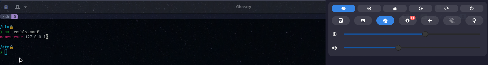
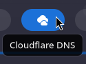
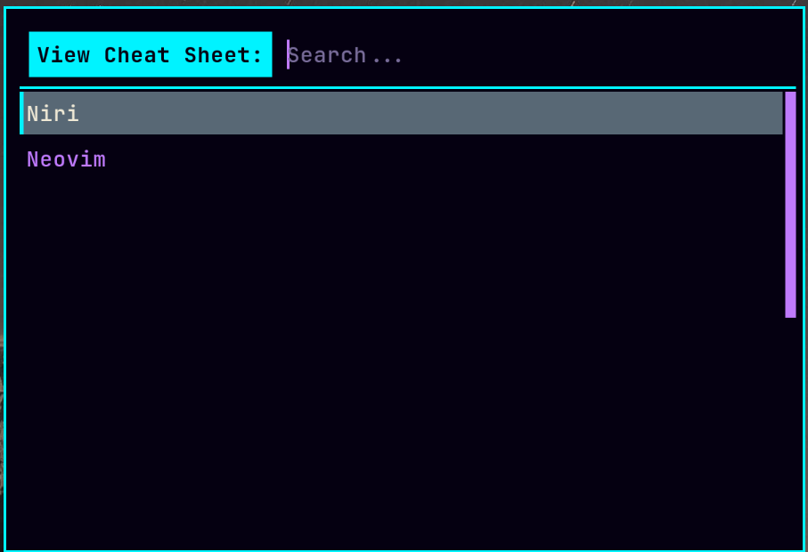
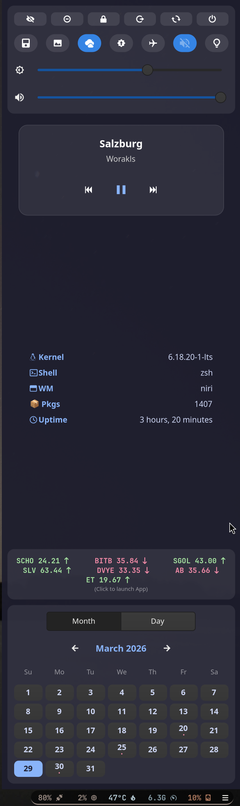
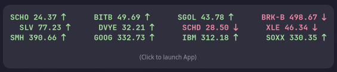

<p align="center">
  
</p>

<h1 align="center">Arch Linux Dotfiles: Niri, Hyprland & Sway</h1>

<p align="left">
  <a href="./LICENSE"></a>
  <a href="https://archlinux.org/"></a>
  <a href="https://wayland.freedesktop.org/"></a>
  <a href="https://www.rust-lang.org/"></a>
  <a href="https://www.gnome.org/"></a>
  <a href="https://neovim.io/"></a>
  <a href="https://github.com/tmux/tmux"></a>
  <a href="#my-arch-dotfiles"></a>
  <a href="https://www.shellcheck.net/"></a>
</p>

[](#support-the-project)

## Screenshots

<p align="center">
  
  
  </p>
<p align="center">
  
  
</p>

This is my obsessive setup for a minimal, multi-compositor Arch Linux environment. I run **Niri** primarily, **Hyprland** when docked, and a custom **Sway** session (iGPU-only) hyper-optimized for battery life. Gnome is included for when a full desktop is needed (e.g., Zoom annotations).

The whole point is efficiency and performance. This setup idles at **4.8W** on my ThinkPad X1 Extreme (i7-10850H, 64GB RAM, GTX 1650 Ti, 4k display).

---

## 🚀 Installation

### ⚠️ Beta Warning
>
> **The Rust Installer is currently in BETA.**
> While I use this daily, it performs major system changes. If you encounter errors, please open an issue with your hardware details.

### 1. Preparation: Get Your API Keys

The installer will ask for these. It is much easier to generate them before you start.

1. **Weather (OpenWeatherMap):** [Sign Up Free](https://home.openweathermap.org/users/sign_up)
2. **Stocks (Finnhub):** [Sign Up Free](https://finnhub.io/register)
3. **Geolocation (Google Cloud):** *Required for automatic location detection.*

<details>
<summary><strong>🌍 Click here for Google Geolocation Instructions (Required)</strong></summary>

The weather module uses Geoclue, which requires the **Google Maps Geolocation API** to find your laptop (since most laptops lack GPS).

**You must enable Billing for this API.**
*Don't panic: Google gives $200/month free credit. You will likely never pay a cent, but a card is required.*

1. Go to [Google Cloud Console](https://console.cloud.google.com).
2. **Create a Project:** Name it "Arch-Weather".
3. **Enable the API:** Search for **"Geolocation API"** (Not Geocoding) and click **Enable**.
4. **Create Credentials:** Go to **APIs & Services > Credentials** → **Create Credentials** → **API Key**.
5. **Enable Billing:** Go to **Billing** in the sidebar and link a card.
6. **Copy the Key:** Paste this into the installer when prompted.

Note: **When setting up Google Billing, you may see a temporary authorization hold ($1-$10) to verify your card. This is not a charge and will disappear in a few days. If you cannot provide a card, you can manually edit /etc/geoclue/geoclue.conf to use [ip] location instead of [wifi].**

</details>

### 2. Run the Installer

This one-liner downloads the bootstrap script, which installs Git/Rust, clones this repo, and launches the configuration wizard.

```bash
cd ~ && curl -O https://raw.githubusercontent.com/Mccalabrese/rust-wayland-power/main/bootstrap.sh && chmod +x bootstrap.sh && ./bootstrap.sh
```

*Note: If the installer detects missing GPU drivers (e.g., fresh Arch install), it will install them and ask you to reboot. Simply run this command again after rebooting to resume exactly where you left off.*

### 🛡️ Safety & Backups

The installer is designed to be **non-destructive**.

  > **Existing Configs:** If a config file (like .zshrc or .config/waybar) already exists, the installer will rename it to filename.backup before linking the new one. nothing is deleted.

  > **Neovim:** To respect your personal setup, the installer will NOT touch your ~/.config/nvim if it already exists.

*Want my Neovim setup? If you have an existing nvim config but prefer to switch to my LazyVim setup, simply move your old folder and link mine manually:*

```bash
mv ~/.config/nvim ~/.config/nvim.old
ln -s ~/rust-wayland-power/.config/nvim ~/.config/nvim
```

### 🛠️ Post-Install Fixes

**Display Scaling (Everything looks huge/tiny?)**
This config is optimized for 4k Screens (scale 2.0). If you are on a 1080p Screen, everything will look zoomed in.
To Fix:

    Niri: Edit ~/.config/niri/config.kdl -> Find output "eDP-1" -> Change scale 2.0 to 1.0.

    Sway: Edit ~/.config/sway/config -> Find output * scale 2 -> Change to scale 1.

## 🔄 Updates & Maintenance

This system is designed to keep the core tooling fresh without overwriting your personal customizations.

* **🦀 Rust Scripts & Daemons (Auto-Updating):**
    The built-in system updater (triggered via the Waybar "Update" icon) acts as a rolling-release manager for my custom tools. It automatically checks this repository for changes to the `sysScripts` directory. If updates are found, it will pull the code and recompile the binaries (`waybar-finance`, `wp-daemon`, etc.) on the fly.

* **⚙️ Dotfiles & Configs (Manual):**
    Your configuration files (`.config/sway`, `.zshrc`, `waybar/config.jsonc`, etc.) are **yours**. The updater will **never** touch them, ensuring your personal tweaks are safe.
  * *Need the latest config features?* If you want to sync with my latest rice or fixes, treat this GitHub repository as a reference manual and copy the specific lines you need into your local files.

## 📂 Documentation

* **[Manual Installation Guide](docs/MANUAL_INSTALL.md):** Prefer to run commands yourself? Read this.
* **[Power Management (NVIDIA)](docs/POWER_MANAGEMENT.md):** How I achieved sub-5W idle on a gaming laptop.

---

## My Custom Rust Binaries

All the helper scripts in this repo have been rewritten in Rust for maximum performance and stability. **These tools can be used independently of the rest of my dotfiles.** Here is what each one does:

* **`waybar-switcher`**: A small utility that runs at login to detect which session you're in (Niri, Hyprland, or Sway) and automatically loads the correct Waybar config.
* **`waybar-weather`**: The weather module in Waybar. It's a custom-built app that securely gets your API key from the central config, finds your location, and fetches the weather.

<p align="center">
  
  </p>

* **`sway-workspace`**: A simple helper that reliably gets the current workspace name for the Waybar module in Sway.
* **`update-check`**: The update icon in Waybar. It safely checks for new `pacman` and `yay` updates and shows the count. It's network-aware and displays a "stale" count if you're offline.
* **`cloudflare-toggle`**:
  * **`cf-status`**: The "CF" icon in Waybar that shows if you are using Cloudflare DNS over HTTPS.
  * **`cf-toggle`**: The `on-click` script that securely toggles Cloudflare DNS over HTTPS on or off using `pkexec`.

<p align="center">
  
  
  </p>

* **`wallpaper-manager`**: A 3-part system that manages all your wallpapers.
  * **`wp-daemon`**: A silent, background daemon that watches your wallpaper folder for changes and auto-generates thumbnails.
  * **`wp-select`**: The Rofi-based pop-up menu (`Mod+W`) that lets you see your wallpaper thumbnails and choose a new one.
  * **`wp-apply`**: The back-end tool that actually sets the wallpaper, using the correct tool for your session (`swaybg` or `swww`).

<p align="center">
  
  </p>

* **`kb-launcher`**: The keybind cheat sheet (`Mod+Shift+P`). It's a pop-up menu that reads your `.txt` files to show you the keybinds for Niri, Sway, Hyprland, or Neovim.

<p align="center">
  
  
  </p>

* **`updater`**: The `on-click` script for the `update-check` module. It simply launches your terminal (`ghostty`) to run the actual system update.

* **`sidebar`**: Sidebar control interface. Includes a calender, finance tooltip that launches TUI on click, launchers to rust binaries, and system controls like brightness and volume.

<p align="center">
  
  </p>

* **`rfkill-manager`**:
  * `--status`: The airplane icon in your SwayNC, showing if "Airplane Mode" is on or off.
  * `--toggle`: The `on-click` action (in your `swaync` panel or on a keybind) that toggles all wireless (Wi-Fi & Bluetooth) on or off.
* **`clip-manager`**: The clipboard history manager (`Mod+Alt+V`). It uses `cliphist` as a backend and pipes your selection to Rofi, allowing you to copy, delete, or wipe your clipboard history.

<p align="center">
  
  </p>

* **`emoji-picker`**: The emoji selector (`Mod+Alt+E`). It uses a built-in Rust emoji database to give you a fast, searchable Rofi menu for copying any emoji.

<p align="center">
  
  </p>

* **`radio-menu`**: A rofi based, extremely lightweight and low power consumption internet radio streaming tool that caches favorite stations for quick selection.

<p align="center">
  
  </p>

* **`waybar-finance`**: A lightweight TUI market watch list application with charts, and security details. Designed to be run in a terminal multiplexer like tmux or ghostty. This will request that you create and enter a Finnhub.io API key on first run. The app will display quoting of your watchlist items as a tooltip on hover over its icon in Waybar.

<p align="center">
  
  
  </p>

### The Philosophy: Why Rust?

You'll see all my helper scripts are written in Rust. I'm not a "Rust-acean," but I am a pragmatist.

Why not Python? I chose Rust to avoid dependency hell and runtime errors. I wanted compiled, single-binary tools that sip battery and don't break when I update system Python packages.

Why not shell scripts? My old scripts were a disaster zone of pgrep, jq, sed, awk, and cat all piped together. They were fragile, slow, and hard to maintain.

**I like Zig, I like C, I make zero claim at all about whether Rust should or should not be in the kernel.**

## Support the Project

If these dotfiles saved you time or improved your battery life, consider buying me a coffee (or a textbook). I'm a computer engineering student, and every bit helps!

* **BTC:** `bc1qvanmtuwn3jd5wurlj3wc9j7ddcwcwwzhjj6ndx`
* **ETH:** `0x1dC04e98A9762fdb86F09437813Ce73D9112dF96`
